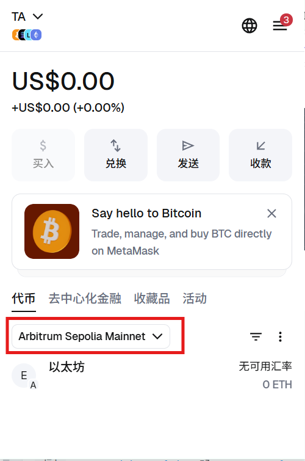
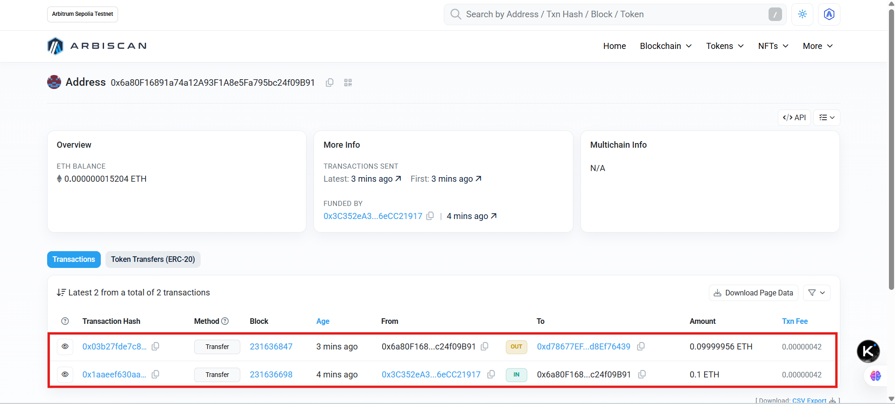
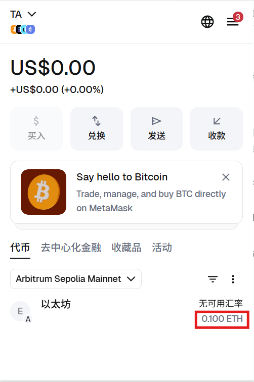
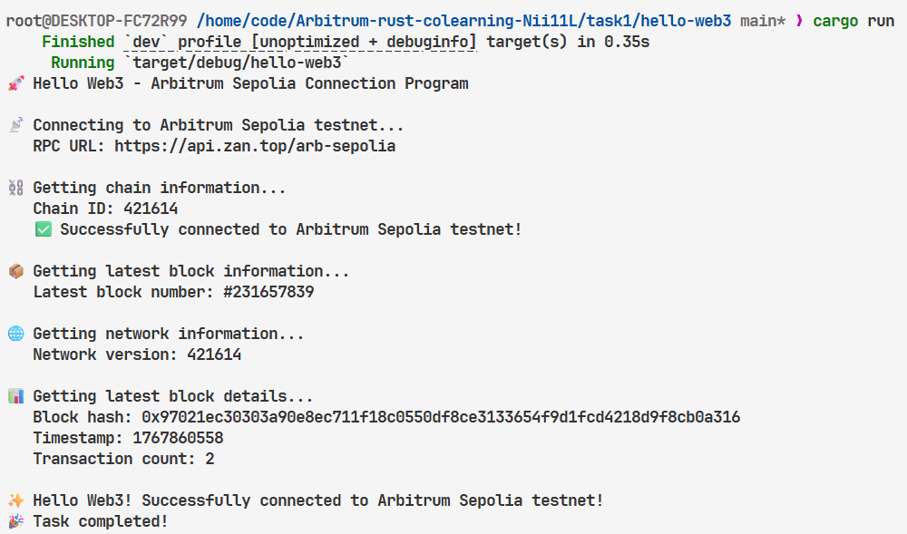
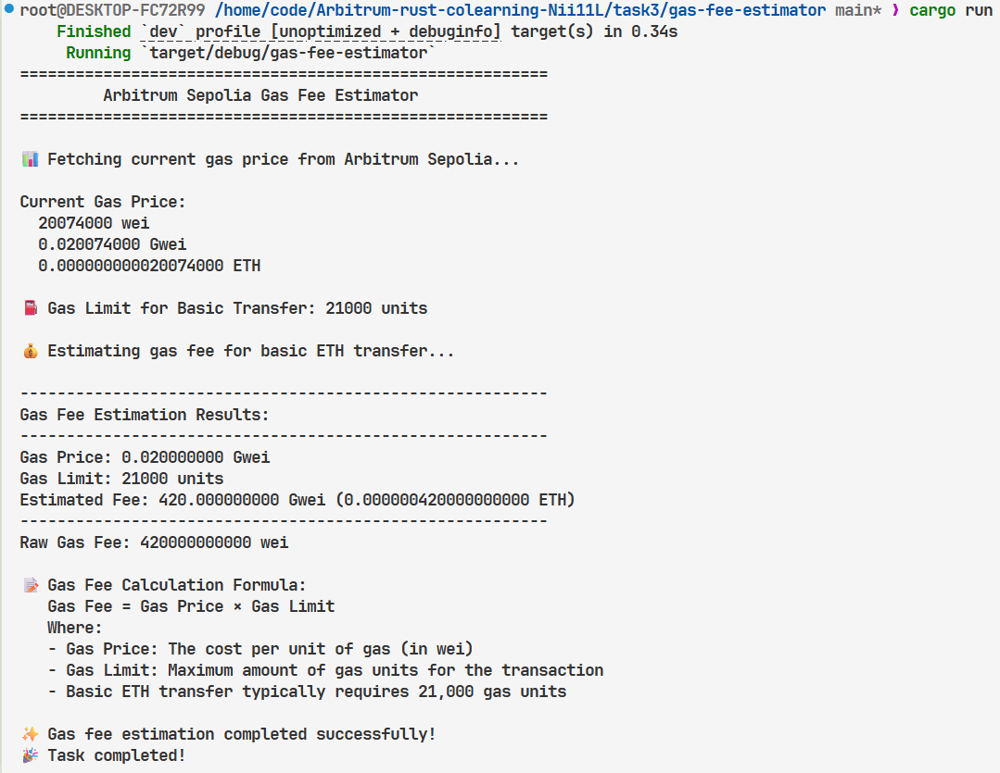
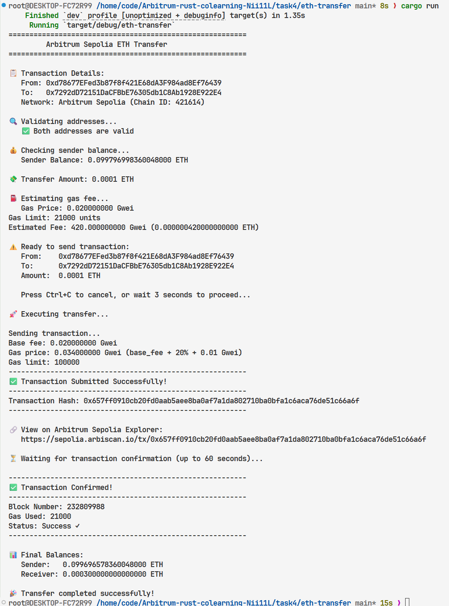
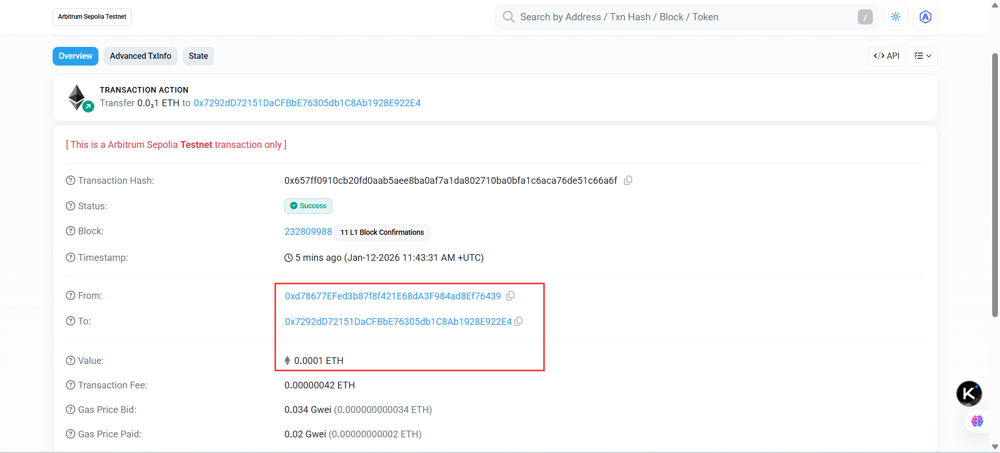
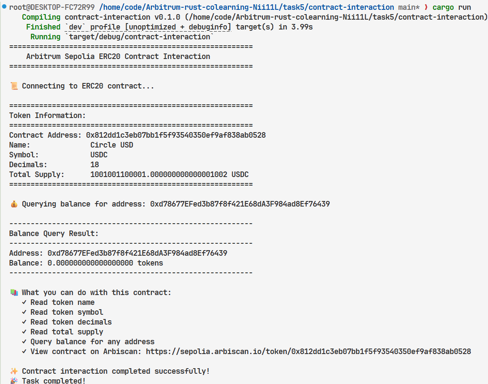

# Arbitrum Rust 共学项目

## Task 1: Hello Web3 - 连接 Arbitrum Sepolia 测试网

### Part 1: MetaMask 配置

#### 1. 切换到 Arbitrum Sepolia 测试网
- 网络名称：Arbitrum Sepolia
- RPC URL：https://sepolia-rollup.arbitrum.io/rpc
- 链 ID：421614



#### 2. 领取测试币
通过 Alchemy 水龙头领取测试 ETH，并转入测试钱包。



#### 3. 验证收到测试币
测试钱包成功收到 0.1 ETH。



### Part 2: Hello Web3 程序

#### 1. 环境准备
- 代码路径：**/task1/hello-web3/**
- 安装 Rust 环境（版本 1.91.0）
- 创建新项目：`cargo new hello-web3`
- 引入依赖：ethers-rs、tokio、dotenv

#### 2. 程序功能
- 连接 Arbitrum Sepolia 测试网
- 获取链 ID、最新区块号、网络信息
- 显示区块详细信息

#### 3. 运行结果

程序成功连接并显示链上信息。



---

## Task 2: 余额查询 - 查询 Arbitrum Sepolia 测试网地址余额

### 1. 环境准备
- 代码路径：**/level2-balance-query/**
- 创建新项目：`cargo new balance-query`
- 引入依赖：ethers-rs、tokio、dotenv

### 2. 程序功能
- 连接 Arbitrum Sepolia 测试网
- 查询指定地址的 ETH 余额
- 将余额从 wei 转换为 ETH 格式（1 ETH = 10^18 wei）
- 显示原始余额和格式化后的余额

### 3. 代码结构
- `src/main.rs` - 主程序入口，调用余额查询函数
- `src/balance.rs` - 余额查询模块，包含 `query_balance()` 函数
- `.env` - RPC 配置文件

### 4. 运行结果

程序成功查询地址 `0xd78677EFed3b87f8f421E68dA3F984ad8Ef76439` 的余额。


**查询结果：**
- 原始余额：99,999,564,586,000,000 wei
- 格式化余额：0.099999564586 ETH (约 0.1 ETH)

---

## Task 3: Gas 费估算器 - Arbitrum Sepolia 测试网 Gas 费预估

### 1. 环境准备
- 创建新项目：`cargo new gas-fee-estimator`
- 引入依赖：ethers-rs、tokio、dotenv

### 2. 程序功能
- 连接 Arbitrum Sepolia 测试网
- 获取实时 Gas 价格
- 计算 ETH 转账的 Gas 费用
- 显示 Gas 价格、Gas 限制、预估费用

### 3. Gas 费计算逻辑

#### 核心公式
```
Gas Fee = Gas Price × Gas Limit
```

### 4. 核心代码实现

#### Gas 价格查询 (`src/gas.rs:9-17`)

#### Gas 费估算 (`src/gas.rs:28-50`)

#### 标准 Gas 限制 (`src/gas.rs:60-64`)

### 5. 运行结果

程序成功获取 Arbitrum Sepolia 测试网的实时 Gas 价格并计算费用。



**查询结果：**
- Gas Price: 0.01 Gwei
- Gas Limit: 21,000 units
- Estimated Fee: 210 Gwei (0.00021 ETH)

---

## Task 4: ETH 转账 - Arbitrum Sepolia 测试网 ETH 转账

### 1. 环境准备
- 创建新项目：`cargo new eth-transfer`
- 引入依赖：ethers-rs、tokio、dotenv
- 配置 `.env` 文件（私钥、RPC URL）

### 2. 程序功能
- 地址校验（发送方和接收方）
- 私钥安全处理（环境变量）
- Gas 费自动估算（EIP-1559）
- 交易签名与广播
- 交易确认监控
- 转账前后余额查询

### 3. 交易详情

| 参数 | 值 |
|------|-----|
| From | `0xd78677EFed3b87f8f421E68dA3F984ad8Ef76439` |
| To | `0x7292dD72151DaCFBbE76305db1C8Ab1928E922E4` |
| Amount | 0.0001 ETH |
| Network | Arbitrum Sepolia (Chain ID: 421614) |

### 4. 转账脚本代码

#### 地址校验 (`src/transfer.rs:13-27`)

#### Gas 费计算（EIP-1559）(`src/transfer.rs:124-148`)

**公式**: `gas_price = base_fee + 20% of base_fee + 0.01 Gwei tip`

#### ETH 转账执行 (`src/transfer.rs:91-162`)

### 5. 运行结果

程序成功执行 ETH 转账，并可在 Arbitrum Sepolia 区块浏览器查询交易。



**转账结果：**
- 交易哈希: 0x5d3c235419c70fe9ea9be6a76a2a0acd69d0184913de3ba97cbf8a0dc4fd6061
- 状态: Success ✓
- Gas Used: 21,000
- 转账金额: 0.0001 ETH



**验证方式：**
可在 [Arbiscan Sepolia Explorer](https://sepolia.arbiscan.io/tx/0x5d3c235419c70fe9ea9be6a76a2a0acd69d0184913de3ba97cbf8a0dc4fd6061) 查询交易详情。

---

## Task 5: 合约交互 - ERC20 Token 合约查询

### 1. 环境准备
- 创建新项目：`cargo new contract-interaction`
- 引入依赖：ethers-rs、tokio、dotenv、serde、serde_json
- 准备 ERC20 ABI 文件

### 2. 程序功能
- 从 JSON 文件加载合约 ABI
- 连接 Arbitrum Sepolia 上的 ERC20 合约
- 查询代币信息（名称、符号、精度）
- 查询总供应量
- 查询指定地址的代币余额

### 3. 合约详情

| 参数 | 值 |
|------|-----|
| Contract Address | `0x812dD1c3EB07bb1F5f93540350EF9aF838AB0528` |
| Token Name | Wrapped Ether |
| Token Symbol | WETH |
| Network | Arbitrum Sepolia (Chain ID: 421614) |
| Explorer | [Arbiscan](https://sepolia.arbiscan.io/token/0x812dD1c3EB07bb1F5f93540350EF9aF838AB0528) |

### 4. 合约交互代码

#### ABI 加载 (`src/contract.rs:12-21`)

#### 合约实例创建 (`src/contract.rs:44-67`)

#### 只读合约调用 (`src/contract.rs:70-97`)

### 5. 运行结果

程序成功连接到 USDC 合约并查询代币信息。



**查询结果：**
- Contract Address: 0x812dD1c3EB07bb1F5f93540350EF9aF838AB0528
- Name: Circle USD
- Symbol: USDC
- Decimals: 18
- Total Supply: 1001001100001.000000000000001002 USDC